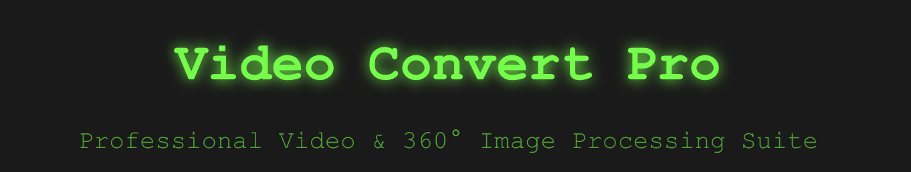

# Video Convert Pro

A professional video and 360° image processing suite with a dark theme interface.

## Features

1. **Video Metadata Extractor** - Extract and save video metadata to JSON format
2. **Video Editor** - Extract frames or trim video segments with metadata preservation options
3. **360° Image Processor** - Process 360° images with various editing capabilities
4. **Cube Map Converter** - Convert 360° images into 6-sided cube maps

## Installation

### Prerequisites
- Node.js (v14 or higher)
- npm or yarn

### Quick Start
```bash
# Use the startup script (recommended)
./start-server.sh

# Or manually start both servers:
# Terminal 1 - Backend
cd server
npm install
npm start

# Terminal 2 - Frontend
cd client
npm install
npm start
```

## Usage

1. Start the backend server (runs on port 5001)
2. Start the frontend application (runs on port 3000)
3. Open your browser to `http://localhost:3000`

## Troubleshooting

If you encounter connection errors like "Failed to fetch" or "ERR_CONNECTION_RESET":

1. **Check if the server is running**: You should see "Server running on port 5001" in the terminal
2. **Test the API**: Visit `http://localhost:5001` - you should see a JSON response
3. **Check for port conflicts**: Make sure nothing else is using port 5001
4. **Install dependencies**: Run `npm install` in the server directory

For detailed troubleshooting, see [TROUBLESHOOTING.md](TROUBLESHOOTING.md)

## Features Overview

### Video Metadata Extractor
- Upload video files to extract complete metadata
- Save metadata to JSON files
- Supports all common video formats (MP4, AVI, MOV, WMV, etc.)

### Video Editor
- Extract frames from videos
- Trim video segments with precise timing
- Optional metadata preservation
- Output frames to organized folders

### 360° Image Processor
- Process 360° images with various actions
- Extract frames or crop images
- Metadata extraction and preservation

### Cube Map Converter
- Convert 360° images to 6-sided cube maps
- Batch processing support
- Generates separate images for each cube face (front, back, left, right, top, bottom)
- Organized output structure

## API Endpoints

- `POST /api/video/metadata` - Extract video metadata
- `POST /api/video/save-metadata` - Save metadata to JSON
- `POST /api/video/extract-frames` - Extract frames from video
- `POST /api/video/trim` - Trim video segments
- `POST /api/360image/process` - Process 360° images
- `POST /api/360image/cube-map` - Convert to cube maps

## Theme

The application features a dark theme with:
- Dark backgrounds (#1a1a1a, #2a2a2a)
- Green text and accents (#00ff00, #00cc00)
- Monospace font (Courier New)
- Glowing effects and smooth transitions

## Dependencies

### Backend
- Express.js for server framework
- Multer for file uploads
- Fluent-ffmpeg for video processing
- Sharp and Jimp for image processing
- CORS for cross-origin requests

### Frontend
- React with TypeScript
- Custom CSS with dark theme
- Responsive design
- Drag & drop file upload

## Output Structure

- Videos: `server/output/`
- Frames: `server/output/frames_[timestamp]/`
- Cube Maps: `server/output/cubemap_[timestamp]/`
- Metadata: `server/output/[filename]_metadata.json`

## License

This project is licensed under the MIT License - see the [LICENSE](LICENSE) file for details.

## Contributing

1. Fork the repository
2. Create a feature branch
3. Make your changes
4. Submit a pull request

## Support

For issues and questions, please create an issue in the GitHub repository.